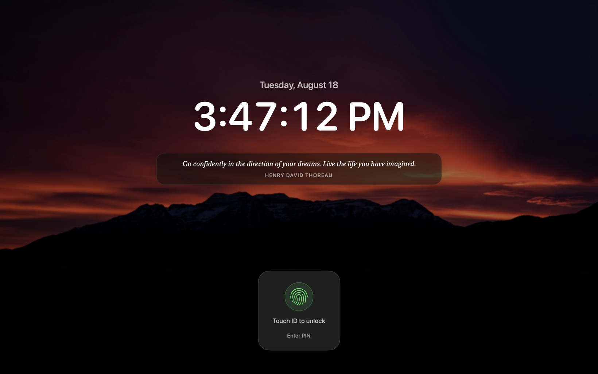

<h1 align="center">Veil</h1>

<p align="center">
  <strong>A soft lock for macOS.</strong><br>
  Covers the screen, blocks the keyboard, and leaves the Mac awake and reachable.
</p>

<p align="center">
  <a href="../../releases/latest"><strong>⬇ Download the latest release</strong></a>
</p>

<p align="center">
  
</p>

---

## What it's for

Locking a Mac the normal way costs you the machine. The display sleeps, work in
the background stalls, and anything you were reaching remotely drops. Leaving it
unlocked costs you your privacy instead — anyone walking past has everything.

Veil is the third option. The screen is covered and the keyboard does nothing,
but the Mac underneath never left: it stays awake, stays online, keeps running
what it was running, and stays reachable from another computer. Privacy without
handing over the machine.

Useful if you leave a Mac running in a room other people walk through, keep long
jobs going while you are away from it, or reach your desktop from a laptop
elsewhere and need the physical screen to show nothing.

## What it does

- **Covers every display** — one full-screen lock per monitor, rebuilt as you
  plug and unplug them.
- **Blocks the keyboard and mouse** — physical input is swallowed while the lock
  is up. Cmd-Tab, Cmd-Q, Force Quit, the Dock and the menu bar all stop working.
- **Keeps the Mac awake** — lid open or shut, it does not sleep and does not drop
  off the network.
- **Touch ID or a PIN** — the sensor stays live for the whole lock, and revives
  itself if macOS quietly drops it.
- **Your own wallpapers** — point it at a folder. Shuffled or in order, the same
  image everywhere or a different one per display, rotating on whatever interval
  you like.
- **Or a blurred desktop** — skip wallpapers and Veil freezes a heavily blurred
  capture of whatever was on screen.
- **Rotating quotes** — optional, from a file you can edit.

## Install

1. Download `Veil-x.y.z.dmg` from the [latest release](../../releases/latest).
2. Drag **Veil.app** into **Applications**.
3. Open **Terminal** and run this once:

   ```
   xattr -dr com.apple.quarantine /Applications/Veil.app
   ```

4. Open Veil normally. It appears in the menu bar — there is no Dock icon and no
   window on launch.

### Why that Terminal step

Veil is code-signed but not *notarized*, which needs a paid Apple Developer
account. macOS blocks any downloaded app that isn't notarized, usually with
*"Veil is damaged"* or a developer-cannot-be-verified warning.

The command clears the "downloaded from the internet" flag. It changes nothing
about the app and leaves the signature intact — check it yourself with
`codesign --verify /Applications/Veil.app`. It's a one-time step; updates after
that install on their own.

## Before you rely on it

> [!IMPORTANT]
> **Set a PIN first.** Veil refuses to lock without one, and for good reason:
> there is no escape hatch. A live lock releases on Touch ID or the PIN and on
> nothing else. Touch ID can stop responding for reasons outside Veil's control,
> and the PIN is the credential that cannot.

Lock once while you are not depending on it and confirm your PIN gets you back
in.

## Permissions

Both live in **System Settings → Privacy & Security**, and both must be granted
on each Mac — permissions do not travel with the app.

| Permission | What breaks without it |
|---|---|
| **Accessibility** | No input blocking, and hold-Esc does nothing |
| **Screen Recording** | The blurred-desktop backdrop; wallpapers still work |

Veil asks for Accessibility itself — click **Grant Accessibility…** in its menu.
That order matters: an app that has never requested the permission does not
appear in the Privacy list at all, so opening the pane first shows you a list
without Veil in it.

## Updates

Veil checks this repository and updates itself. Every build is signed with an
EdDSA key whose public half is compiled into the app, so a tampered download is
rejected even though the feed itself is public and unauthenticated.

## What Veil is not

**It is not a security boundary.** A reboot defeats it — that is inherent, since
the input blocking dies with the process. Recovery mode, target disk mode and SSH
are untouched.

It stops someone walking up to an open laptop and casually using it, and it stops
anyone reading what is on screen. It does not stop someone determined. What
covers you after a reboot is FileVault, so leave that on. Veil handles the case
FileVault cannot: a Mac you want left awake, unlocked, and reachable, that nobody
can walk up and use.

---

<sub>This repository carries the downloads and the update feed only — no source
code. Release assets on a private repository require authentication, which would
mean shipping a credential inside the app. The source lives in a separate private
repository.</sub>
